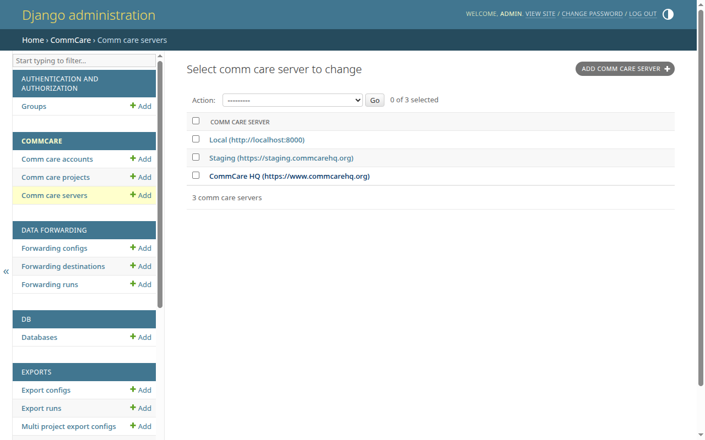

# Add a CommCare HQ server

Register a CommCare HQ server (for example <https://www.commcarehq.org>, or a
self-hosted HQ instance) so users can attach projects to it. This is an admin
task — regular users won't see this option.

## Prerequisites

- Admin / superuser access to CommCare Data Pipeline.
- The URL of the CommCare HQ server you want to register.

<!-- prettier-ignore-start -->
> [!NOTE]
> This form lives in the Django admin at `/admin/`. You'll need superuser
> access to reach it — the regular app navigation doesn't expose CommCare
> server management.
<!-- prettier-ignore-end -->

## Steps

1. Sign in to CommCare Data Pipeline as a superuser, then go to `/admin/` on
   your deployment.
2. Under the **CommCare** section, click **Comm care servers**.
3. Click **Add comm care server** in the top-right of the list page.

   

4. Fill in the form:
   - **Name** (required) — a short label shown in dropdowns, for example
     `CommCare HQ` or `Staging`.
   - **Url** (required) — the full base URL of the HQ server, for example
     `https://www.commcarehq.org`.
5. Click **Save**.

If you leave either field blank, the form shows **This field is required.** next
to the blank field.

## Next steps

- [Add a CommCare Project](../users/add-commcare-project.md) — attach an HQ
  project space to the server you just registered.
