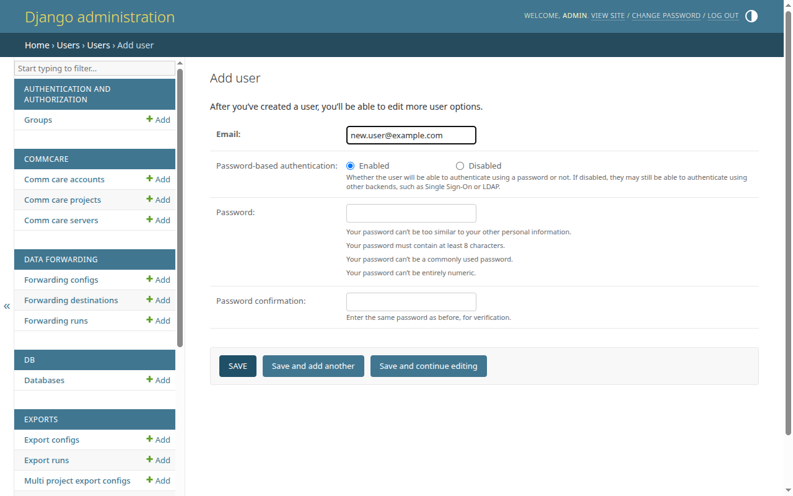

# Add a new user

Create a CommCare Data Pipeline user. New users sign in with their email address
and a password set by the admin who creates the account.

<!-- prettier-ignore-start -->
> [!NOTE]
> CommCare Data Pipeline identifies users by **email address**, not
> username. The email you enter on the add-user form is the value the
> user will sign in with.
<!-- prettier-ignore-end -->

## Prerequisites

- Superuser access to CommCare Data Pipeline.

## Steps

1. Sign in to CommCare Data Pipeline as a superuser, then go to `/admin/` on
   your deployment.
2. In the **Users** section, click **Users** (or click **Add** beside it to jump
   straight to step 4).
3. Click **Add user** in the top right of the user list.
4. Fill in the form:
   - **Email** (required) — the user's email address. This is the value they
     will sign in with.
   - **Password-based authentication** — leave on **Enabled** for normal
     accounts. Select **Disabled** if the user will sign in only through another
     backend (e.g. SSO or LDAP).
   - **Password** / **Password confirmation** — set an initial password. The
     form enforces Django's default password validators (minimum length, not too
     common, not entirely numeric, not too similar to other personal
     information).
5. Click one of the save buttons:
   - **Save** — create the user and open their full edit page (so you can fill
     in name, permissions, etc.).
   - **Save and add another** — create the user and return to a fresh add form.
   - **Save and continue editing** — create the user and stay on the edit page.

After saving you land on the full user-detail page, where you can fill in the
remaining fields: first name, last name, avatar, and the **Permissions** group
(active status, staff status, superuser status, groups, and individual
permissions).

## Setting admin permissions

By default new users are created with `is_staff` and `is_superuser` both unset,
which is correct for a regular user of the data pipeline.

To grant admin access, open the user's edit page and use the **Permissions**
section:

- **Staff status** — lets the user sign in to `/admin/`.
- **Superuser status** — grants all permissions without explicitly assigning
  them. Reserve this for trusted administrators.
- **Groups** and **User permissions** — for finer-grained access control.

Click **Save** at the bottom of the edit page to apply the change.

## Next steps

- [Reset a password](reset-password.md) — if the user can't sign in or forgets
  the initial password.
- [Delete a user](delete-user.md) — if you need to remove the account later.
