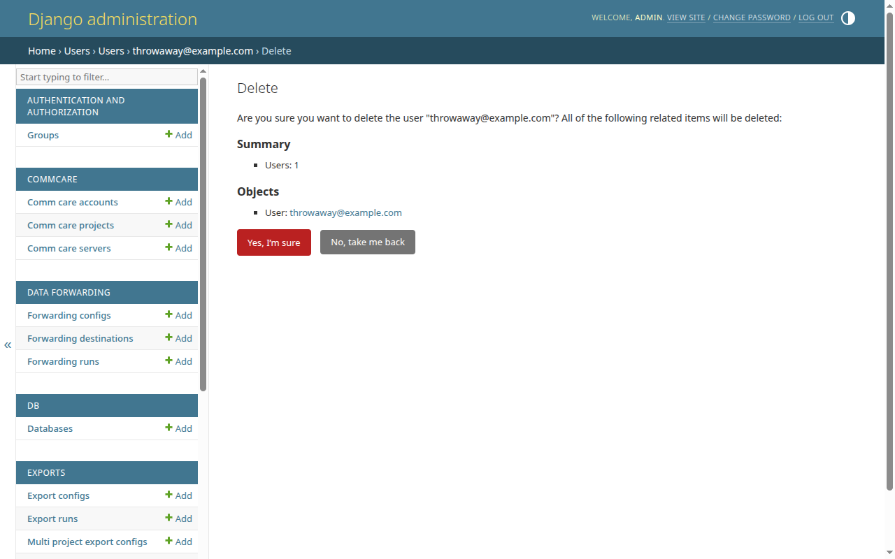

# Delete a user

Remove a CommCare Data Pipeline user account from the Django admin. Django shows
you exactly what else gets deleted (or has its owner cleared) before you commit.

<!-- prettier-ignore-start -->
> [!WARNING]
> Deleting a user is permanent. Anything the user owned — exports,
> forwarders, schedules, refresh configs — is listed on the confirmation
> page. Some objects cascade-delete with the user; others stay but lose
> their owner. Read the confirmation page carefully before clicking
> through.
<!-- prettier-ignore-end -->

## Prerequisites

- Superuser access to CommCare Data Pipeline.
- The email address of the user you want to delete.

## Delete one user from their detail page

1. Sign in as a superuser, then go to `/admin/users/customuser/` on your
   deployment.
2. Click the user's email address to open their detail page.
3. Scroll to the bottom of the form and click the red **Delete** button on the
   left.
4. Django shows the **Are you sure?** confirmation page. It begins with "Are you
   sure you want to delete the user "&lt;email&gt;"? All of the following
   related items will be deleted:" and then lists every object that will be
   removed along with the user, grouped by type under **Summary** and
   **Objects**.
5. If everything in the list is expected, click **Yes, I'm sure**. You land back
   on the user list with a success message and the user is gone.



To back out without deleting, click **No, take me back** — Django returns you to
the user-detail page and nothing changes.

## Delete several users at once

1. Go to `/admin/users/customuser/`.
2. Tick the checkbox in the left column for each user you want to delete.
3. From the **Action** dropdown above the list, choose **Delete selected
   users**, then click **Go**.
4. The same confirmation page appears, but the **Summary** and **Objects**
   sections enumerate the related items for _every_ selected user. Review the
   list carefully.
5. Click **Yes, I'm sure** to commit, or **No, take me back** to abort.

## What the confirmation page tells you

The list under **Objects** is your audit trail before the delete fires. For a
brand-new account that has never created anything, you'll see only the user
itself:

```
Summary
Users: 1
Objects
User: <email>
```

For a long-tenured account, the list also enumerates every related record Django
would touch: export configs, multi-project export configs, forwarding configs,
forwarding destinations, refresh configs, and so on. Each related object is
rendered with its admin label so you can spot anything you didn't expect to
lose. If the list contains records that other users still depend on, cancel the
delete and reassign ownership first — there is no undo once you click **Yes, I'm
sure**.

## Next steps

- [Add a new user](add-user.md) — recreate the account if it was a mistake.
- [Reset a password](reset-password.md) — disable an account without deleting
  it.
