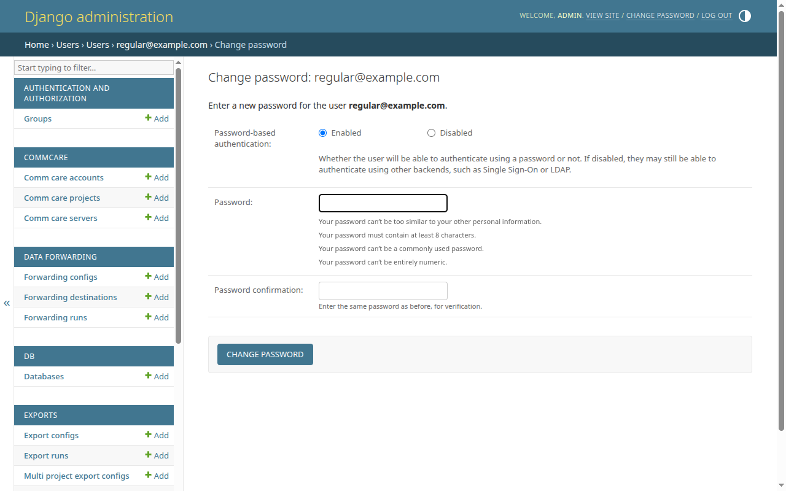

# Reset a password

Reset another user's password from the Django admin. The user can sign in with
the new password immediately — no email or other confirmation is involved.

<!-- prettier-ignore-start -->
> [!NOTE]
> CommCare Data Pipeline does not store user passwords in plain text, so
> admins can only set a new password, never see the existing one. The
> user-detail page shows only the algorithm, iteration count, salt
> prefix, and hash prefix.
<!-- prettier-ignore-end -->

## Prerequisites

- Superuser access to CommCare Data Pipeline.
- The email address of the user whose password you're resetting.

## Steps

1. Sign in as a superuser, then go to `/admin/users/customuser/` on your
   deployment.
2. Click the user's email address to open their detail page.
3. Beside the **Password** field, click the **Reset password** button.
4. On the **Change password: <email>** form, fill in:
   - **Password** — the new password. The form enforces Django's default
     password validators (minimum length, not too common, not entirely numeric,
     not too similar to other personal information).
   - **Password confirmation** — repeat the new password for verification.
5. Click **Change password**. You land back on the user-detail page with the
   success message "Password changed successfully."

Hand the new password to the user through a secure channel. They can sign in
immediately with their email address and the new password.

## What the user sees

Changing the password rotates the user's password hash. Django's session
authentication detects the rotation and signs the user out of any existing
browser sessions on their next request, so they will need to sign in again with
the new password.

## Disabling password-based authentication

The change-password form also exposes a **Password-based authentication** toggle
(Enabled / Disabled). Set it to Disabled only if the user should sign in
exclusively through another backend (e.g. SSO or LDAP). Disabling password-based
authentication discards the current password hash; re-enabling it requires
setting a new password.

## Next steps

- [Add a new user](add-user.md) — create another account.
- [Delete a user](delete-user.md) — remove an account entirely.
