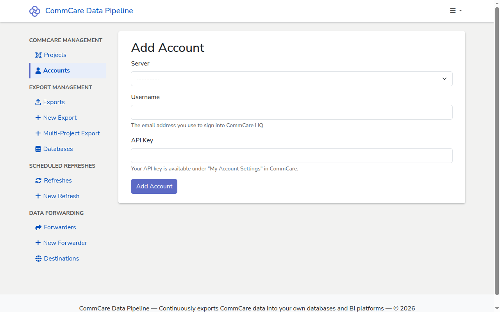

# Add a CommCare Account

Add the CommCare HQ credentials CommCare Data Pipeline will use to pull data
from a project space. Each account is a username plus an HQ API key, scoped to a
single CommCare HQ server.

## Prerequisites

- A CommCare HQ server registered in CommCare Data Pipeline. If none exists yet,
  ask an admin to follow
  [Add a CommCare HQ server](../admin/add-commcare-server.md).
- A CommCare Project registered in CommCare Data Pipeline — see
  [Add a CommCare Project](add-commcare-project.md).
- A CommCare HQ API key for the account you want to use. In CommCare HQ, open
  the user dropdown in the top-right, choose **My Account Settings → API Keys**,
  generate a key dedicated to the pipeline (for example
  `docs-walkthrough-pipeline`), and copy the value before you navigate away — HQ
  does not show it again.

<!-- prettier-ignore-start -->
> [!WARNING]
> API keys are secrets. Generate one specifically for the pipeline rather
> than reusing a personal key, and treat the value like a password — don't
> paste it into shared chats or check it into version control.
<!-- prettier-ignore-end -->

## Steps

1. In the sidebar, go to **CommCare Management → Accounts**.

2. Click **+ New Account** in the top right of the accounts list.

   

3. On the **Add Account** page, fill in the form:
   - **Server** — pick the CommCare HQ server from the dropdown (for example
     `Local (http://localhost:8000)`). The account is scoped to this server.
   - **Username** — the email address you use to sign into CommCare HQ, for
     example `admin@example.com`.
   - **API Key** — paste the API key you generated on CommCare HQ. The in-form
     hint reminds you it lives under "My Account Settings" in CommCare.

4. Click **Add Account**. You return to the accounts list and the new account
   appears in the table, showing its username, the server it's bound to, and the
   owner.

<!-- prettier-ignore-start -->
> [!NOTE]
> All three fields are required. If you submit the form with any field
> blank, the browser highlights the missing field rather than posting an
> empty form.
<!-- prettier-ignore-end -->

The account is bound to one CommCare HQ server, not to a specific project. Any
project on that server can use it, as long as the HQ user has permission to read
the project's data.

<!-- prettier-ignore-start -->
> [!TIP]
> If your CommCare HQ user has elevated privileges, create a dedicated
> service user in the target project space with the minimum permissions
> needed to export data, and use that user's API key here.
<!-- prettier-ignore-end -->

## Next steps

- [Add a database](add-database.md) — register where the pipeline should write
  exported data.
