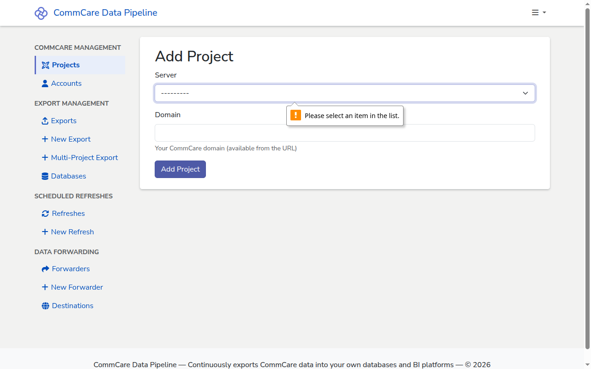

# Add a CommCare Project

Register a CommCare HQ project space with CommCare Data Pipeline. After adding a
project you can attach an account (credentials), pick which exports to run, and
forward results to other systems.

## Prerequisites

- A CommCare HQ server registered in CommCare Data Pipeline. If none exists yet,
  ask an admin to follow
  [Add a CommCare HQ server](../admin/add-commcare-server.md).
- The **project space** (also called "domain") name on the CommCare HQ server.
  You can find this in the HQ URL: in
  `https://www.commcarehq.org/a/<project-space>/dashboard/`, `<project-space>`
  is the value you want.

## Steps

1. In the sidebar, go to **CommCare Management → Projects**.

2. Click **+ New Project** in the top right of the projects list.

   

3. On the **Add Project** page, fill in the form:
   - **Server** — pick the CommCare HQ server from the dropdown. The list shows
     every HQ server an admin has registered (for example
     `CommCare HQ (https://www.commcarehq.org)`).
   - **Domain** — type the project space name, for example `docs-walkthrough`.
     This is the bare name only, not a full URL.

4. Click **Add Project**. You return to the projects list and the new project
   appears in the table, linked to its dashboard on the chosen server.

<!-- prettier-ignore-start -->
> [!NOTE]
> Both fields are required. If you submit the form with either field
> blank, the browser highlights the missing field — the server picker
> with "Please select an item in the list." and the domain box with
> "Please fill out this field."
<!-- prettier-ignore-end -->

## Next steps

- [Add a CommCare Account](add-commcare-account.md) — add the credentials that
  CommCare Data Pipeline will use to pull data from this project.
