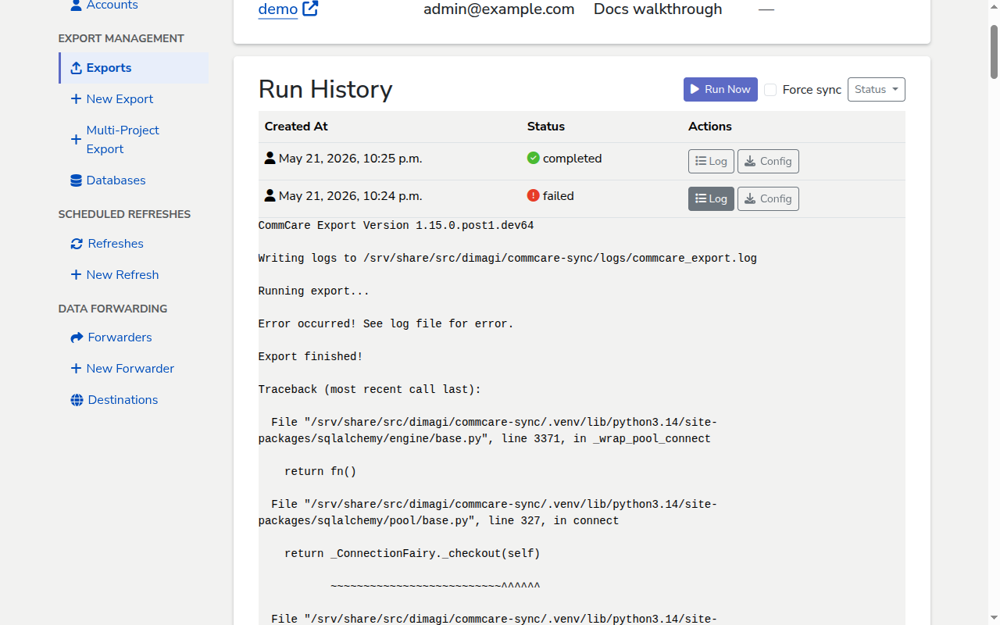

# Checking the logs for a run

When an export run finishes — successfully or not — its log captures everything
`commcare-export` did, line by line. This page shows where to find that log and
how to read it.

## Prerequisites

- An export with at least one run. See [Set up an export](set-up-export.md).

## Open the log

1. From the sidebar, open **Exports** and click the export you want to inspect.
2. Scroll to **Run History**.
3. In the row for the run you want to investigate, click **Log**.

The log expands inline underneath the row. Click **Log** again to collapse it.
Only runs in `completed` or `failed` status have a log to show — for `queued`
and `started` runs the button is disabled.



<!-- prettier-ignore-start -->
> [!TIP]
> If you only want to see runs that failed, click the **Status** button
> above the table and uncheck the statuses you don't care about. The
> filter persists across page reloads via the URL.
<!-- prettier-ignore-end -->

## Reading the log

The log is the raw stdout from the `commcare-export` command-line tool. It is
plain text, one event per line, in the order events happened. A successful case
export typically contains:

- A version line — `CommCare Export Version 1.15.0.post1.dev64`.
- One or more `Creating checkpoint manager for tables: …` lines, noting how far
  the previous run got.
- `Fetching 'case' batch: {...}` lines, one per page of data pulled from
  CommCare HQ.
- `Received N of M` lines showing how many records came back.
- `Schema check complete for N rows in table '…'. Final columns: [...]` — the
  columns the export decided to write.
- `Setting final checkpoint: …` — the new high-water mark stored for the next
  run.
- `Running export...` followed by `Export finished!` at the end.

If you see `Export finished!` and no traceback, the run succeeded even if
individual lines look noisy.

## Diagnosing a failed run

A failure looks the same as a successful run up to the point where something
went wrong, then ends with `Error occurred! See log file for error.`, a blank
line, and a Python traceback. The most useful line is usually the last one — it
spells out the underlying exception.

For example, an export pointed at an unreachable database produces:

```
psycopg2.OperationalError: connection to server at "127.0.0.1", port 1
failed: Connection refused
    Is the server running on that host and accepting TCP/IP connections?
```

That is enough to know the export's **Database** is misconfigured — the host,
port, credentials, or database name in the connection string is wrong, or the
database server is down. Fix the connection on the [Databases](add-database.md)
page, then trigger a new run.

When the failing line is from `requests` (the HTTP client `commcare-export` uses
to talk to CommCare HQ), the response status code tells you what to fix:

- A `401 Client Error: Unauthorized` means the **Account**'s API key is wrong or
  has been revoked. Regenerate the key in CommCare HQ and re-enter it on the
  account.
- A `403 Client Error: Forbidden` means the account exists but its user doesn't
  have permission to read the project space's data on CommCare HQ.

If `commcare-export` raises a `KeyError` or `ValueError` from inside its own
code, the saved DET configuration is referring to a field that no longer exists
on CommCare HQ. Update the DET configuration on CommCare HQ, then re-select it
on the export's **Edit** page so the pipeline fetches the new version.

<!-- prettier-ignore-start -->
> [!NOTE]
> The log shown here is the run's own log, captured separately from the
> shared `logs/commcare_export.log` file on the server. The on-server
> file mixes output from every run; the inline log is scoped to one run
> only.
<!-- prettier-ignore-end -->

## Next steps

- [Understanding the statistics](understanding-statistics.md) — see what the
  surrounding Run History fields mean.
