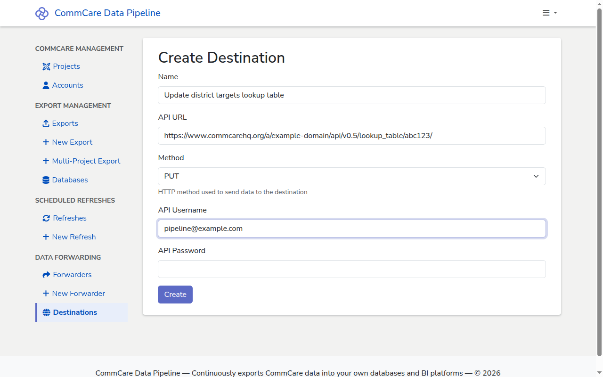

# Forward data to a CommCare fixture

A CommCare HQ **lookup table** (also called a **fixture**) holds reference data
that CommCare apps read at runtime — drop-down options, geographic codes,
monthly targets. CommCare Data Pipeline can keep a lookup table in sync with
data in one of your databases by pushing updates to HQ's lookup-table API on a
schedule.

This guide assumes you have already read
[Forward data to DHIS2](forward-to-dhis2.md) — the destination and forwarder
forms are the same generic HTTP forwarder, and the steps for creating each are
identical. This guide covers only what is different for a CommCare lookup-table
endpoint: the URL, the authentication, and the payload your SQL query must
produce.

Two workflows are supported, depending on whether you want to refresh an
existing table or append new rows:

- **Replace the whole table** — one `PUT` to `lookup_table/<table_id>/` per run,
  sending the full set of rows. Use this for the common case of keeping a lookup
  table in sync with a source-of-truth table.
- **Create rows one at a time** — one `POST` to `lookup_table_item/` per run,
  sending a single new row. Use this when you want to append rows to a table
  without touching existing rows.

The rest of this guide walks through both.

## Prerequisites

- A CommCare HQ lookup table already exists in the target project space. Create
  it from **Project Settings → Lookup tables** in CommCare HQ and note its
  **table ID** (or item resource URL).
- An HQ web user with the **Edit Lookup Tables** permission in that project
  space, and an **API key** generated for that user from **My Account Settings →
  API Keys**. See [Add a CommCare Account](add-commcare-account.md) for how the
  pipeline stores HQ credentials.
- [A database connection](add-database.md) holding the data to push.

## What CommCare HQ expects

The lookup-table API is documented at
<https://commcare-hq.readthedocs.io/api/fixture.html>. The relevant facts for
configuring a forwarder are:

- **Base URL** — `https://<HQ host>/a/<domain>/api/v0.5/`
- **Resources** —
  - `lookup_table/` for table metadata. `POST` to the list URL creates a new
    table; `PUT` to `lookup_table/<table_id>/` replaces an existing table.
  - `lookup_table_item/` for the rows of a table. `POST` to the list URL creates
    one row at a time; `PUT` to `lookup_table_item/<item_id>/` replaces an
    existing row.
- **Authentication** — HTTP Basic auth, passing the HQ username and the API key
  (as the password). CommCare HQ accepts this in place of an
  `Authorization: ApiKey ...` header on the lookup-table API.
- **Body** — JSON. The shape is described in the API docs linked above; for a
  row it includes the parent `table` URI, a `fields` dictionary, and a
  `data_type` of `"string"` for each field by default.

## Create the destination

Both workflows use the
[generic HTTP destination](forward-to-dhis2.md#create-the-destination); the
**API URL** and **Method** are what distinguish them. A destination is one
operation — if you need both PUT-to-replace and POST-to-append against the same
table, create two destinations and give them distinct names.

### Destination for replacing a whole table (`PUT`)

- **Name** — for example, `Update district targets lookup table`.
- **API URL** — the table's item URL for the target project space, for example
  `https://www.commcarehq.org/a/example-domain/api/v0.5/lookup_table/abc123/`,
  where `abc123` is the table ID.
- **Method** — `PUT`.
- **API Username** — the HQ web user's email address.
- **API Password** — the API key generated for that user.

### Destination for creating rows (`POST`)

- **Name** — for example, `Add district targets row`.
- **API URL** — the lookup-table-item list URL for the target project space, for
  example
  `https://www.commcarehq.org/a/example-domain/api/v0.5/lookup_table_item/`.
- **Method** — `POST` (the default).
- **API Username** — the HQ web user's email address.
- **API Password** — the API key generated for that user.



## Create the forwarder

Follow the same steps as in
[Forward data to DHIS2 → Create the forwarder](forward-to-dhis2.md#create-the-forwarder).
The **Query** must return a single row with a single column containing the JSON
body for the destination's API.

### Payload for `PUT lookup_table/<table_id>/`

A single payload describes the table's field definitions and every row. The
exact schema is in the
[lookup-table API docs](https://commcare-hq.readthedocs.io/api/fixture.html);
producing it from your warehouse rows — including aggregating all rows into a
single JSON document — is a data-engineering task outside the scope of this
guide. Sketched in PostgreSQL:

```sql
SELECT json_build_object(
  'fields', json_build_array(
    json_build_object('field_name', 'district_code'),
    json_build_object('field_name', 'target_visits')
  ),
  'item_list', json_agg(
    json_build_object(
      'fields', json_build_object(
        'district_code', district_code,
        'target_visits', target_visits::text
      )
    )
  )
) AS payload
FROM district_targets
```

Each forwarder run replaces all rows in the table.

### Payload for `POST lookup_table_item/`

The payload identifies the parent table and the row's field values, for example:

```sql
SELECT json_build_object(
  'data_type', 'string',
  'table', '/a/example-domain/api/v0.5/lookup_table/abc123/',
  'fields', json_build_object(
    'district_code', district_code,
    'target_visits', target_visits::text
  )
) AS payload
FROM district_targets
WHERE district_code = :param1
```

Each forwarder run sends one row to HQ.

## Next steps

- [Checking the logs for a run](checking-run-logs.md) — every forwarder run
  produces a log, viewable the same way as exports and refreshes.
