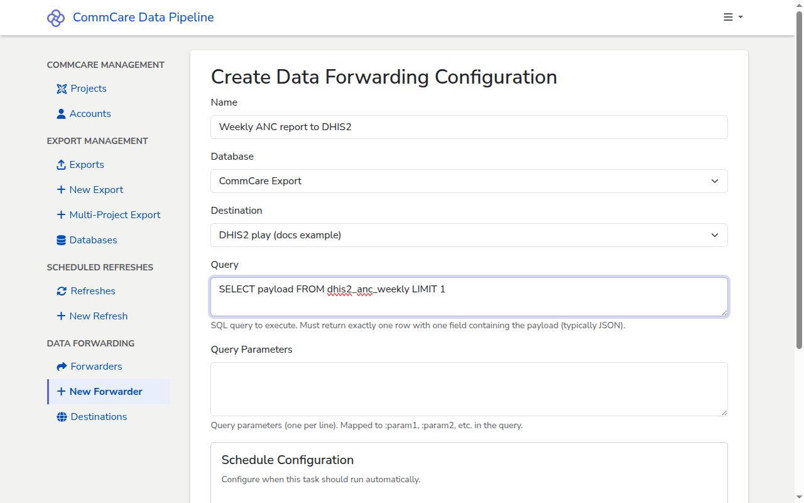

# Forward data to DHIS2

[DHIS2](https://dhis2.org/) is an open-source health management information
system. CommCare Data Pipeline can push aggregated data from one of your
databases into a DHIS2 endpoint on a schedule. This guide covers configuring
that forwarder; the data must already be aggregated in the shape DHIS2 expects.

A forwarder in CommCare Data Pipeline is a generic HTTP forwarder — it runs a
SQL query against one of your databases, takes the single value the query
returns, and sends it as the request body to a configured API URL. To send data
to DHIS2, you point that API URL at a DHIS2 import endpoint (for example
`/api/dataValueSets`) and write a SQL query that returns the DHIS2 JSON payload.

## Prerequisites

- [A database connection](add-database.md) holding the aggregated data.
- The aggregated data already mapped to the DHIS2 `dataElement` /
  `categoryOptionCombo` / `period` / `orgUnit` structure, and stored in a table
  or view that produces the DHIS2 JSON payload as a single value. Building that
  mapping is outside the scope of this guide — ask your data team for the
  artifact the forwarder needs.
- A DHIS2 endpoint to push to. From DHIS2 you will need:
  - The base URL of the DHIS2 server (for example `https://play.dhis2.org/dev`)
    and the import path you intend to use (commonly `/api/dataValueSets`).
  - Credentials with permission to import data values for the relevant dataset.

<!-- prettier-ignore-start -->
> [!WARNING]
> Treat DHIS2 credentials the same as any other secret. Create a dedicated
> service account for the pipeline rather than reusing a personal login,
> and give it only the permissions it needs to import into the target
> dataset.
<!-- prettier-ignore-end -->

<!-- prettier-ignore-start -->
> [!NOTE]
> CommCare Data Pipeline does not generate DHIS2 payloads for you. The SQL
> query you configure must return a single row with a single column that
> already contains the JSON body DHIS2 expects.
<!-- prettier-ignore-end -->

## Create the destination

A **destination** stores the DHIS2 endpoint and credentials. You configure it
once and reuse it from any number of forwarders.

1. In the sidebar, under **Data Forwarding**, click **Destinations**, then **+
   New Destination**.
2. Fill in:
   - **Name** — a label for this DHIS2 endpoint, for example
     `Production DHIS2 — Data Values`.
   - **API URL** — the full URL of the DHIS2 import endpoint, for example
     `https://play.dhis2.org/dev/api/dataValueSets`.
   - **Method** — leave as `POST` for DHIS2.
   - **API Username** — the DHIS2 service account username.
   - **API Password** — the DHIS2 service account password. The password is
     encrypted at rest.
3. Click **Create**.

## Create the forwarder

A **forwarder** ties together a source database, the SQL query that produces the
payload, the destination to send it to, and a schedule.

1. In the sidebar, under **Data Forwarding**, click **+ New Forwarder**.
2. Fill in:
   - **Name** — a label for this forwarder, for example
     `Weekly ANC report to DHIS2`.
   - **Database** — the database containing the aggregated data.
   - **Destination** — the DHIS2 destination you created above.
   - **Query** — the SQL query that returns the DHIS2 payload. It must return
     exactly one row with one column, and that column must contain the JSON body
     DHIS2 expects. For example:

     ```sql
     SELECT payload FROM dhis2_anc_weekly LIMIT 1
     ```

   - **Query Parameters** (optional) — one parameter per line, mapped to
     `:param1`, `:param2`, … in the query. Use this when the query needs a
     period or org unit substituted at run time.

3. Under **Schedule Configuration**, pick how often the forwarder should run
   automatically. Schedule types include every N minutes/hours/days, weekly on
   specific days, monthly, quarterly, semi-annually, and annually. Leave the
   schedule blank to run the forwarder only on demand.
4. Click **Create**.



After you save, you land on the forwarder detail page. From there you can run it
once on demand, view its run history, and follow the link on any run to
[check the logs](checking-run-logs.md).

## Pausing or deleting the forwarder

To stop a forwarder from running on its schedule, open it from the
**Forwarders** list, click **Edit**, set **Schedule Type** back to the blank
option, and save. The forwarder remains and can still be run on demand.

To remove a forwarder entirely, open it from the **Forwarders** list and click
**Delete**. Deleting a forwarder does not delete its destination — remove the
destination separately from the **Destinations** list if no other forwarder uses
it.

## Next steps

- [Checking the logs for a run](checking-run-logs.md) — every forwarder run
  produces a log, viewable the same way as exports and refreshes.
