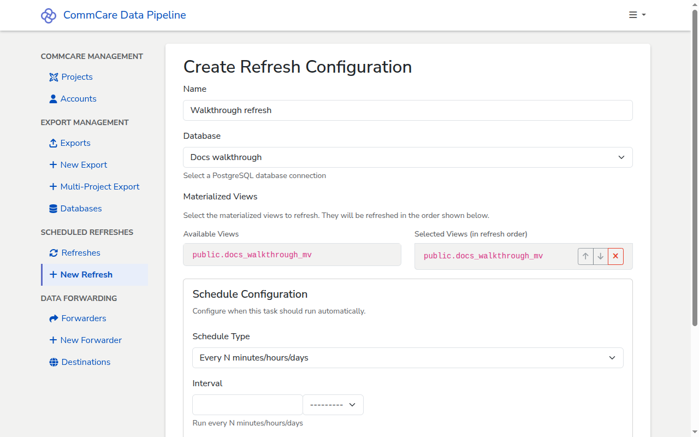

# Schedule a materialized view refresh

Materialized views aren't kept current automatically — they have to be refreshed
on a schedule. CommCare Data Pipeline can run that schedule for you. This guide
covers attaching a schedule to a view; creating the view itself is done in your
database.

## Prerequisites

- [A database connection](add-database.md) pointing at the PostgreSQL database
  where the materialized view lives. Only PostgreSQL is supported.
- A materialized view that already exists on that database.

<!-- prettier-ignore-start -->
> [!NOTE]
> If you don't have a materialized view yet, ask your database
> administrator to create one. Designing and writing the view itself is
> out of scope for this guide — CommCare Data Pipeline only refreshes
> views that already exist.
<!-- prettier-ignore-end -->

## Steps

1. From the sidebar, under **Scheduled Refreshes**, click **+ New Refresh**. The
   **Create Refresh Configuration** page opens.
2. Enter a **Name** for the refresh. Choose something that describes what the
   refresh covers — for example, `Vaccination coverage views`.
3. Pick the **Database** that holds the materialized view. The list only
   includes PostgreSQL connections.
4. After the database is selected, the page queries it for materialized views
   and lists them under **Available Views**. Click a view to move it to
   **Selected Views (in refresh order)**. Add as many as you need; reorder them
   with the up and down arrows.
5. If every selected view has a unique index, a **Refresh concurrently**
   checkbox appears. Leave it on to refresh without locking the view — readers
   continue to see the old data until the refresh finishes. Clear it to take an
   exclusive lock for the duration of the refresh.
6. Under **Schedule Configuration**, pick a **Schedule Type**:
   - **Every N minutes/hours/days** — the simplest option; enter an **Interval**
     like `6` and unit `Hours`.
   - **Weekly on specific days** — pick a **First Run Date**, **Run Time**,
     **Timezone**, and the **Days of Week** to run on.
   - **Monthly on specific day** — runs on the same day-of-month as the **First
     Run Date**.
   - **Quarterly**, **Semi-annually (twice per year)**, **Annually** — spaced
     from **First Run Date** at **Run Time** in the chosen **Timezone**.
7. Click **Create**. You land on the refresh's detail page.

<!-- prettier-ignore-start -->
> [!TIP]
> To check the schedule is wired up correctly, click **Run Now** on the
> detail page. The Run History table fills in with a `completed` row and
> a per-view result. See
> [Checking the logs for a run](checking-run-logs.md) for how to read
> the output.
<!-- prettier-ignore-end -->

## Pausing or deleting a refresh

There's no separate pause toggle. To stop a refresh from running on its
schedule, do one of:

- **Edit** the refresh and set **Schedule Type** back to the blank option
  (`---------`). The refresh stays in the list (the list shows a pause icon next
  to its name) and you can re-enable it later by picking a schedule again. You
  can still trigger it manually with **Run Now**.
- **Delete** the refresh from its detail page when you no longer need it.
  Deletion removes the configuration and its run history.

## Next steps

- [Checking the logs for a run](checking-run-logs.md) — every refresh run has a
  log, viewed the same way as an export run.
