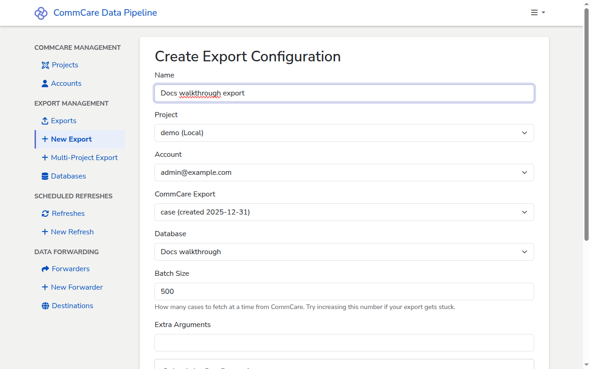

# Set up an export

Configure CommCare Data Pipeline to pull data from a CommCare HQ project and
land it in one of your registered databases. This is the central user workflow —
most other features (statistics, scheduling, forwarding) attach to an export.

## Prerequisites

- [A CommCare project](add-commcare-project.md) registered in the pipeline
- [A CommCare account](add-commcare-account.md) with an API key for that
  project's server
- [A database connection](add-database.md) to land the data in
- A **Data Export Tool (DET) configuration** already saved on CommCare HQ for
  the project. The pipeline fetches the list of saved configs from HQ; it does
  not accept an uploaded query file. To create a DET config, use the **Export
  Data** screens in CommCare HQ. The underlying tool is documented at
  <https://github.com/dimagi/commcare-export/>.

<!-- prettier-ignore-start -->
> [!NOTE]
> The **CommCare Export** dropdown is populated by calling the
> `det_export_instance` API on the selected project's server, authenticated
> with the selected account's API key. Both fields must be set before any
> configs appear.
<!-- prettier-ignore-end -->

## Steps

1. In the sidebar, under **Export Management**, click **+ New Export**.

2. Fill in the **Create Export Configuration** form:
   - **Name** — a short label for this export (for example,
     `Docs walkthrough export`).
   - **Project** — the CommCare project to pull data from.
   - **Account** — the CommCare account whose API key will authenticate the
     export.
   - **CommCare Export** — the DET configuration to run. Set **Project** and
     **Account** first; the dropdown populates with the DET configs saved on HQ
     for that project, fetched using the account's API key.
   - **Database** — the database connection that will receive the data.
   - **Batch Size** — how many cases to fetch from CommCare in a single API
     page. Defaults to 500. The form's help text suggests increasing this if an
     export gets stuck on a large project.
   - **Extra Arguments** — optional flags passed through to `commcare-export`.
     Leave blank unless you have a specific reason.

3. _(Optional)_ Configure a **Schedule**. Leave **Schedule Type** blank to
   create an export that only runs on demand. To run automatically, pick one of
   the dropdown options:
   - **Every N minutes/hours/days**
   - **Weekly on specific days**
   - **Monthly on specific day**
   - **Quarterly**
   - **Semi-annually (twice per year)**
   - **Annually**

   Each schedule type reveals the additional fields it needs — first run date
   and time, timezone, interval value and unit, or days of the week.

4. Click **Create**. You land on the export's details page, where the header
   shows the project, account, database, and schedule, and a **Run History**
   table sits below.

## Running the export

A configured export does not run on its own unless it has a schedule. To trigger
a run manually:

- From the export's details page, click **Run Now**.
- Or from the **Exports** list page, click the **Run** button on the row for the
  export.

A new row appears in the **Run History** table with a **Created At** timestamp
and a **Status** that moves from _started_ to _completed_ (or _failed_). Click
**Log** on the row to inspect what `commcare-export` did.

<!-- prettier-ignore-start -->
> [!TIP]
> While you are getting an export working, set the schedule to **Every N
> minutes** with a short interval so the pipeline retries frequently. Once
> the export is stable, switch to a longer interval or a daily schedule.
<!-- prettier-ignore-end -->

## Next steps

- [Understanding the statistics](understanding-statistics.md) — make sense of
  what an export run reports back.
- [Checking the logs for a run](checking-run-logs.md) — drill into the detail of
  a specific run.
