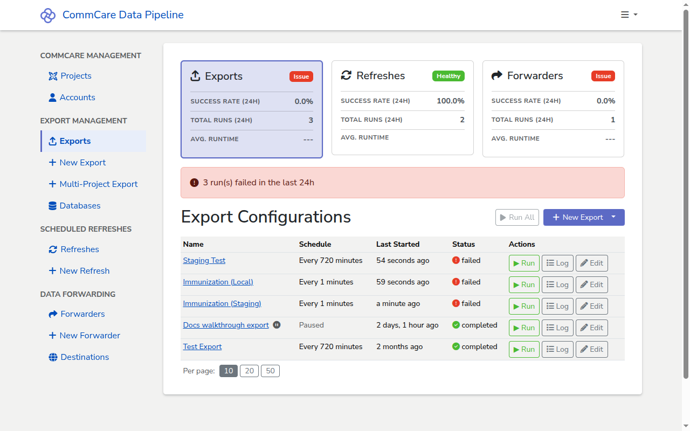

# Understanding the statistics

CommCare Data Pipeline surfaces run statistics in two places: a high-level
summary above each list page (**Exports**, **Refreshes**, **Forwarders**) and a
per-configuration run history on each export, refresh, or forwarder's details
page. This page explains the labels in both views so you can tell at a glance
whether your pipelines are healthy.

## Prerequisites

- At least one export, refresh, or forwarder with at least one run. See
  [Set up an export](set-up-export.md) for getting to the first run.

## The list page summary

The top of each list page shows three **summary cards** — one for **Exports**,
one for **Refreshes**, one for **Forwarders** — giving an at-a-glance health
view across all configurations of that type. The card for the page you're on is
highlighted; clicking another card navigates to that page.

Each card shows the same fields, computed over the last 24 hours:

- **Status badge** — _Healthy_, _Warning_, _Issue_, or _No Data_, derived from
  the success rate (see below).
- **Success Rate (24h)** — completed runs as a percentage of total runs that
  reached a worker (queued runs are not counted).
- **Total Runs (24h)** — the same denominator as above: non-queued runs created
  in the last 24 hours.
- **Avg. Runtime** — average duration of the runs that completed successfully in
  the window.

### Status thresholds

- **Healthy** — 95% or higher success rate.
- **Warning** — 80% to 94% success rate.
- **Issue** — below 80% success rate.
- **No Data** — no non-queued runs in the window.

### The status banner

Below the cards, a single banner summarizes the page you're on:

- **Green** when the page's pipeline is _Healthy_ — "All
  exports/refreshes/forwarders running successfully".
- **Yellow** when _Warning_ or **red** when _Issue_ — "N run(s) failed in the
  last 1d".
- No banner when the status is _No Data_.

The banner reflects only the current page's pipeline; the other cards' status
badges are how you spot trouble in the other two.

## The export header

The top of the export's details page shows the four configuration values that
identify the run target. These are not statistics — they don't change between
runs — but they tell you what each run in the history is doing.

- **Project Space** — the CommCare project the export pulls data from. Links out
  to the project on CommCare HQ.
- **Account** — the CommCare account whose API key authenticates the run.
- **Database** — the database connection the export writes to.
- **Schedule** — the configured schedule, or `—` if the export only runs on
  demand.

<!-- prettier-ignore-start -->
> [!NOTE]
> The header does not show aggregate counters like "total runs", "successful
> runs", or "average duration". The Run History table below is the only place
> to see per-run outcomes.
<!-- prettier-ignore-end -->

## The Run History table

Each row in the table is one run of the export. The table has three columns:

- **Created At** — the timestamp the run row was created, in the server's
  timezone. Hover the row's icon to see who or what triggered the run (for
  example, _Triggered from UI by &lt;user&gt;_ for a manual run).
- **Status** — the current state of the run. See [Status values](#status-values)
  below.
- **Actions** — per-row buttons:
  - **Log** — opens the raw `commcare-export` log for the run. See
    [Checking the logs for a run](checking-run-logs.md).
  - **Config** — downloads the export configuration as it existed at the time of
    the run (a versioned snapshot, so later edits to the export don't change
    what this button returns).

The footer of the table lets you switch between **10**, **20**, and **50** rows
per page.

### Status values

The **Status** column is one of:

- **queued** — the run has been created but a worker hasn't picked it up yet.
- **started** — a worker is currently running the export.
- **completed** — the run finished without errors.
- **failed** — the run hit an unrecoverable error. Open the **Log** to see why.
- **skipped** — the scheduler decided not to run this slot (for example, because
  a previous run was still in progress).
- **multiple** — used for multi-project exports where the per-project sub-runs
  finished with different statuses.

<!-- prettier-ignore-start -->
> [!TIP]
> _queued_ and _started_ are transient. Refresh the page to see the latest
> status; the table does not poll on its own.
<!-- prettier-ignore-end -->

## Per-run detail

There is no separate per-run statistics page. Quantitative details — how many
rows were fetched, which tables were updated, where the checkpoint landed — live
in the run's log. From the Run History row, click **Log** and look for lines
like:

- `Received N of M` — rows pulled from CommCare in a batch.
- `Schema check complete for N rows in table '<name>'` — rows written to the
  destination table.
- `Setting final checkpoint: ...` — the resume point saved for the next run.
- `Export finished!` — the run completed successfully.

See [Checking the logs for a run](checking-run-logs.md) for a walkthrough.

## Next steps

- [Checking the logs for a run](checking-run-logs.md) — drill into what
  `commcare-export` actually did, line by line.
